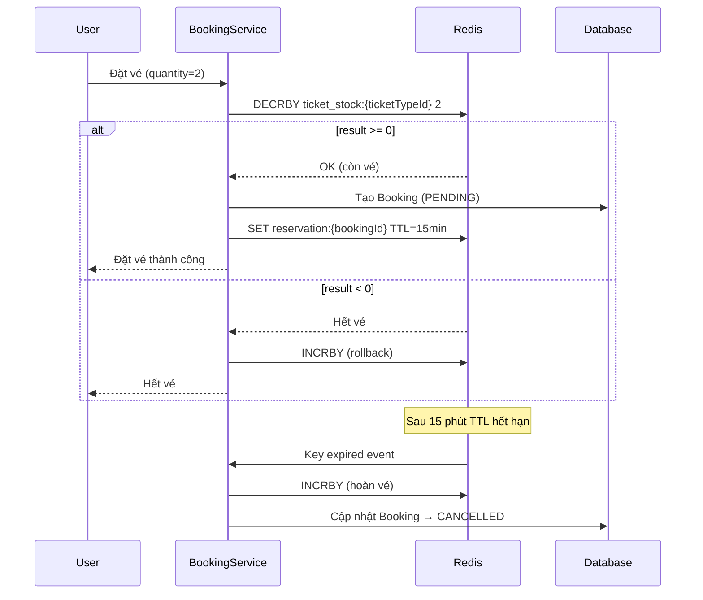

# Redis Ticket Inventory Integration

Nâng cấp hệ thống đặt vé bằng cách sử dụng Redis để quản lý số lượng vé realtime, chống oversell trong điều kiện concurrent cao, đồng thời giữ nguyên logic nghiệp vụ (giữ vé 15 phút).

## Tổng quan kiến trúc



## Proposed Changes

### 1. Redis Configuration

#### [NEW] [RedisConfig.java](file:///d:/VNTicket/vnticket-backend/src/main/java/com/vnticket/config/RedisConfig.java)

- Cấu hình `RedisMessageListenerContainer` để lắng nghe **keyspace notification** (key expiration events)
- Đảm bảo Redis gửi event khi key hết TTL (`notify-keyspace-events Ex`)

---

### 2. Ticket Inventory Redis Service

#### [NEW] [TicketInventoryRedisService.java](file:///d:/VNTicket/vnticket-backend/src/main/java/com/vnticket/service/TicketInventoryRedisService.java)

Service chuyên xử lý inventory trên Redis:

| Method | Mô tả |
|--------|--------|
| `initStock(ticketTypeId, quantity)` | Đồng bộ stock từ DB → Redis khi khởi động |
| `decrementStock(ticketTypeId, quantity)` | Atomic DECRBY, rollback nếu < 0 |
| `incrementStock(ticketTypeId, quantity)` | INCRBY khi hoàn vé |
| `createReservation(bookingId, ticketTypeId, quantity)` | SET key với TTL 15 phút |
| `deleteReservation(bookingId)` | Xóa reservation khi thanh toán thành công |
| `getStock(ticketTypeId)` | Lấy stock hiện tại |

Key patterns:
- `ticket_stock:{ticketTypeId}` → số vé còn lại
- `reservation:{bookingId}` → `{ticketTypeId}:{quantity}` (TTL 15 phút)

---

### 3. Reservation Expiration Listener

#### [NEW] [ReservationExpirationListener.java](file:///d:/VNTicket/vnticket-backend/src/main/java/com/vnticket/listener/ReservationExpirationListener.java)

- Lắng nghe event `__keyevent@0__:expired`
- Khi key `reservation:{bookingId}` hết hạn:
  - Parse `ticketTypeId` và `quantity` từ **shadow key** (`reservation_data:{bookingId}`, không TTL, auto-xóa khi đọc)
  - `INCRBY ticket_stock:{ticketTypeId} quantity` (hoàn vé vào Redis)
  - Cập nhật Booking trạng thái `CANCELLED` trong DB
  - Hủy các electronic tickets liên quan

> [!IMPORTANT]
> Redis keyspace notification **không gửi value** khi key hết hạn, chỉ gửi key name. Vì vậy cần lưu thêm 1 **shadow key** (`reservation_data:{bookingId}`) không có TTL để lưu metadata. Listener sẽ đọc shadow key rồi xóa.

---

### 4. Inventory Sync on Startup

#### [NEW] [TicketInventorySyncRunner.java](file:///d:/VNTicket/vnticket-backend/src/main/java/com/vnticket/config/TicketInventorySyncRunner.java)

- Implements `ApplicationRunner` 
- Khi ứng dụng khởi động → load tất cả `TicketType.remainingQuantity` từ DB vào Redis
- Tính toán có xét đến các booking `PENDING` chưa hết hạn

---

### 5. Modify BookingServiceImpl

#### [MODIFY] [BookingServiceImpl.java](file:///d:/VNTicket/vnticket-backend/src/main/java/com/vnticket/service/impl/BookingServiceImpl.java)

**[bookTicket()](file:///d:/VNTicket/vnticket-backend/src/main/java/com/vnticket/service/BookingService.java#15-16):**
- Bỏ đọc/ghi `remainingQuantity` trực tiếp vào DB
- Thay bằng gọi `TicketInventoryRedisService.decrementStock()` (atomic)
- Nếu thành công → tạo Booking/BookingDetail/Ticket trong DB
- Gọi `TicketInventoryRedisService.createReservation()` để lưu reservation có TTL

**[cancelBooking()](file:///d:/VNTicket/vnticket-backend/src/main/java/com/vnticket/service/BookingService.java#19-20):**
- Gọi `TicketInventoryRedisService.incrementStock()` để hoàn vé vào Redis
- Gọi `TicketInventoryRedisService.deleteReservation()` để xóa reservation
- Cập nhật DB như cũ

**[mockPayBooking()](file:///d:/VNTicket/vnticket-backend/src/main/java/com/vnticket/controller/BookingController.java#94-101) & [processVnPayPayment()](file:///d:/VNTicket/vnticket-backend/src/main/java/com/vnticket/service/impl/BookingServiceImpl.java#365-381):**
- Khi thanh toán thành công → `deleteReservation()` (xóa reservation, vé đã chính thức bán)
- Đồng bộ `remainingQuantity` vào DB

**[cancelExpiredBookings()](file:///d:/VNTicket/vnticket-backend/src/main/java/com/vnticket/service/impl/BookingServiceImpl.java#337-364):**
- Giữ lại làm fallback/safety net nhưng giảm tần suất chạy
- Logic chính chuyển sang `ReservationExpirationListener`

---

### 6. Update application.yml

#### [MODIFY] [application.yml](file:///d:/VNTicket/vnticket-backend/src/main/resources/application.yml)

Thêm cấu hình reservation TTL:
```yaml
app:
  reservation:
    ttlMinutes: 15
```

## Verification Plan

### Manual Verification

Để kiểm chứng tích hợp Redis, cần thực hiện các bước sau:

1. **Khởi động ứng dụng** và kiểm tra log xác nhận inventory đã sync từ DB → Redis
2. **Đặt vé** → kiểm tra Redis có key `ticket_stock:{id}` giảm đúng số lượng và có key `reservation:{bookingId}`
3. **Đặt vé vượt quá số lượng** → xác nhận trả về lỗi "Hết vé" và stock trong Redis không bị âm
4. **Thanh toán thành công** → xác nhận reservation key bị xóa, DB cập nhật PAID
5. **Chờ 15 phút** (hoặc set TTL ngắn để test) → xác nhận vé được hoàn lại trong Redis và booking status chuyển CANCELLED
6. **Hủy vé thủ công** → xác nhận stock tăng lại trong Redis

> [!TIP]
> Để test nhanh hơn, có thể tạm thời set `app.reservation.ttlMinutes=1` trong [application.yml](file:///d:/VNTicket/vnticket-backend/src/main/resources/application.yml) để chỉ cần chờ 1 phút.

Bạn có thể dùng `redis-cli` để quan sát realtime:
```bash
redis-cli MONITOR
# hoặc
redis-cli SUBSCRIBE __keyevent@0__:expired
```
