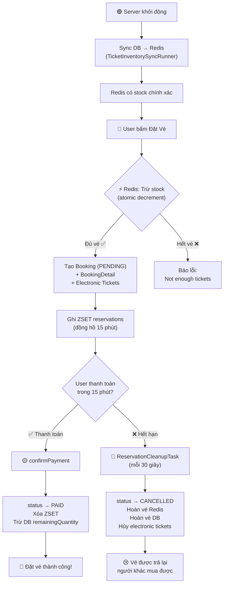

# Luồng Đặt Vé VNTicket với Redis — Giải thích đơn giản

> Hãy tưởng tượng Redis như một **bảng đếm vé treo trên tường** — ai nhìn vào cũng thấy ngay còn bao nhiêu vé, và có thể ghi/xóa cực nhanh. Database (PostgreSQL) là **cuốn sổ cái** — ghi lại chi tiết mọi thứ, nhưng mở ra xem thì chậm hơn.

---

## 🟢 GIAI ĐOẠN 1: Server khởi động ([TicketInventorySyncRunner](file:///d:/VNTicket/vnticket-backend/src/main/java/com/vnticket/runner/TicketInventorySyncRunner.java#18-66))

Khi bật server, việc đầu tiên là **đồng bộ số vé từ Database → Redis**.

```
Server bật → Đọc DB lấy tất cả loại vé → Tính stock thực tế → Ghi lên Redis
```

**Cụ thể:**

| Bước | Hành động | Ví dụ |
|------|-----------|-------|
| 1 | Lấy tất cả `TicketType` từ DB | Vé VIP có `remainingQuantity = 100` |
| 2 | Trừ đi số vé đang bị "giữ" bởi đơn PENDING chưa hết hạn | Có 5 vé đang PENDING |
| 3 | `effectiveStock = 100 - 5 = 95` | |
| 4 | Ghi vào Redis: `ticket_stock:1 = 95` | Redis key = `ticket_stock:{ticketTypeId}` |

> [!IMPORTANT]
> Phải trừ đi PENDING vì những vé đó đang bị "giữ chỗ". Nếu không trừ, 2 người có thể mua cùng 1 vé!

**Sau bước này, Redis có:**
```
ticket_stock:1 = 95    (Vé VIP còn 95)
ticket_stock:2 = 200   (Vé Regular còn 200)
```

---

## 🔵 GIAI ĐOẠN 2: User đặt vé ([bookTicket](file:///d:/VNTicket/vnticket-backend/src/main/java/com/vnticket/service/impl/BookingServiceImpl.java#133-222))

Giả lập: **User A** muốn mua **2 vé VIP** cho sự kiện "Concert ABC".

### Bước 2.1 — Kiểm tra User, Event, TicketType có tồn tại không
```
User A có tồn tại?  ✅
Event "Concert ABC" tồn tại?  ✅
Vé VIP thuộc Event này?  ✅
```

### Bước 2.2 — ⚡ Trừ vé trên Redis (ATOMIC — cực nhanh)
```
Redis: ticket_stock:1 = 95
Lệnh: DECRBY ticket_stock:1 2
Redis: ticket_stock:1 = 93  ➜ kết quả >= 0 → ✅ Đủ vé!
```

> [!TIP]
> Đây là bước quan trọng nhất! Redis xử lý **hàng chục ngàn request/giây** nên dù 1000 người bấm "Đặt vé" cùng lúc, Redis vẫn đảm bảo **không bán quá số vé** nhờ tính atomic.

Nếu kết quả < 0 (hết vé):
```
Redis: ticket_stock:1 = 0
Lệnh: DECRBY ticket_stock:1 2
Kết quả: -2  → ❌ Không đủ vé!
→ Rollback: INCRBY ticket_stock:1 2  → stock trở về 0
→ Báo lỗi "Not enough tickets available"
```

### Bước 2.3 — Tạo Booking trong Database (status = PENDING)
```sql
INSERT INTO bookings (user_id, event_id, booking_time, status, total_amount)
VALUES (1, 10, '2026-03-24 14:30:00', 'PENDING', 1000000);
-- → bookingId = 42
```

### Bước 2.4 — Tạo BookingDetail
```sql
INSERT INTO booking_details (booking_id, ticket_type_id, quantity, price)
VALUES (42, 1, 2, 500000);
```

### Bước 2.5 — Tạo Electronic Tickets (vé điện tử)
```sql
INSERT INTO tickets (ticket_code, booking_detail_id, status)
VALUES ('VNT-A1B2C3D4', 1, 'VALID'),
       ('VNT-E5F6G7H8', 1, 'VALID');
```

### Bước 2.6 — Ghi vào Redis ZSET "reservations" (đồng hồ đếm ngược)
```
ZADD reservations <expireTime> "42|1|2"
```

| Thành phần | Ý nghĩa |
|------------|---------|
| `42` | bookingId |
| `1` | ticketTypeId (VIP) |
| `2` | quantity |
| `expireTime` | `now + 15 phút` (dạng epoch ms) |

> [!NOTE]
> ZSET (Sorted Set) trong Redis sắp xếp theo score = `expireTime`. Khi cần tìm đơn hết hạn, chỉ cần lấy tất cả entry có score ≤ thời gian hiện tại → cực nhanh!

**Sau bước này:**
```
┌─── Redis ─────────────────────────────────────────┐
│ ticket_stock:1 = 93  (đã trừ 2 vé)               │
│ reservations ZSET:                                 │
│   "42|1|2" → score: 1711267800000 (15 phút sau)   │
└───────────────────────────────────────────────────┘

┌─── Database ──────────────────────────────────────┐
│ bookings:                                          │
│   id=42, status=PENDING, total=1.000.000đ          │
│ booking_details:                                   │
│   booking_id=42, ticketType=VIP, quantity=2        │
│ tickets:                                           │
│   VNT-A1B2C3D4 (VALID), VNT-E5F6G7H8 (VALID)     │
│ ticket_types:                                      │
│   id=1, remainingQuantity=100 (CHƯA đổi!)         │
└───────────────────────────────────────────────────┘
```

> [!IMPORTANT]
> Database `remainingQuantity` **chưa bị trừ** ở bước này! Chỉ Redis bị trừ. DB chỉ bị trừ khi thanh toán thành công.

---

## 🟡 GIAI ĐOẠN 3A: Thanh toán THÀNH CÔNG ([confirmPayment](file:///d:/VNTicket/vnticket-backend/src/main/java/com/vnticket/service/impl/BookingServiceImpl.java#374-392))

User A thanh toán trong vòng 15 phút:

### Bước 3A.1 — Kiểm tra
```
Booking 42 có phải của User A?  ✅
Status có đang PENDING?  ✅
Đã quá 15 phút chưa?  ❌ → Còn hạn, cho phép thanh toán
```

### Bước 3A.2 — Đổi status → PAID
```sql
UPDATE bookings SET status = 'PAID' WHERE id = 42;
```

### Bước 3A.3 — Xóa reservation khỏi Redis ZSET
```
ZREM reservations "42|1|2"
```
→ Vì vé đã bán chính thức, không cần "giữ chỗ" nữa.

### Bước 3A.4 — Trừ `remainingQuantity` trong Database
```sql
UPDATE ticket_types SET remaining_quantity = 98 WHERE id = 1;
-- 100 - 2 = 98
```

**Kết quả cuối cùng:**
```
┌─── Redis ─────────────────────────────────────────┐
│ ticket_stock:1 = 93  (không đổi — đã trừ từ lúc đặt)│
│ reservations ZSET: (trống — đã xóa entry)          │
└───────────────────────────────────────────────────┘

┌─── Database ──────────────────────────────────────┐
│ bookings:    id=42, status=PAID ✅                 │
│ ticket_types: remainingQuantity=98 (đã trừ 2)     │
│ tickets:     VNT-A1B2C3D4 (VALID) ✅              │
│              VNT-E5F6G7H8 (VALID) ✅              │
└───────────────────────────────────────────────────┘
```

---

## 🔴 GIAI ĐOẠN 3B: Hết hạn thanh toán (2 cơ chế song song)

Nếu User A **KHÔNG thanh toán** trong 15 phút, hệ thống tự động hủy và **trả vé lại**:

### Cơ chế 1: [ReservationCleanupTask](file:///d:/VNTicket/vnticket-backend/src/main/java/com/vnticket/scheduler/ReservationCleanupTask.java#20-111) (chạy mỗi 30 giây — CƠ CHẾ CHÍNH)

```
Cứ 30 giây, cron job quét Redis ZSET:
  "Có entry nào có score ≤ thời gian hiện tại không?"
```

```
ZRANGEBYSCORE reservations -inf 1711267800000
→ Tìm thấy: "42|1|2"  (đã hết hạn!)
```

**Xử lý:**

| Bước | Hành động | Chi tiết |
|------|-----------|----------|
| 1 | Parse member | `bookingId=42, ticketTypeId=1, quantity=2` |
| 2 | Kiểm tra booking | Status vẫn PENDING? → Tiếp tục |
| 3 | Đổi status → CANCELLED | `UPDATE bookings SET status='CANCELLED'` |
| 4 | Hoàn vé Redis | `INCRBY ticket_stock:1 2` → stock: 93→95 |
| 5 | Hoàn vé Database | `remainingQuantity: 100+2=102`... à khoan, nó vẫn là 100 vì chưa bị trừ! |
| 6 | Hủy vé điện tử | `VNT-A1B2C3D4 → CANCELLED` |
| 7 | Xóa khỏi ZSET | `ZREM reservations "42\|1\|2"` |

### Cơ chế 2: [BookingCleanupTask](file:///d:/VNTicket/vnticket-backend/src/main/java/com/vnticket/scheduler/BookingCleanupTask.java#8-29) (chạy mỗi 5 phút — SAFETY NET)

```
Đề phòng cơ chế 1 bị miss, cứ 5 phút quét Database:
  "Có booking nào PENDING mà bookingTime < (now - 15 phút) không?"
```

→ Nếu tìm thấy → Hủy tương tự.

> [!NOTE]
> Hai cơ chế này **không xung đột** vì cả hai đều kiểm tra `status == PENDING` trước khi hủy. Nếu cơ chế 1 đã hủy rồi thì cơ chế 2 sẽ bỏ qua.

### Nếu User cố thanh toán sau khi hết hạn

```
User A bấm "Thanh toán" sau 20 phút
→ Hệ thống kiểm tra: bookingTime + 15 phút < now? → ĐÃ HẾT HẠN
→ Tự hủy đơn (handleExpiredPaymentAttempt)
→ Báo lỗi: "Thời gian thanh toán đã hết hạn. Đơn hàng đã tự động bị hủy."
```

---

## 📊 Tổng quan luồng bằng sơ đồ



---

## 💡 Tại sao dùng Redis mà không chỉ dùng Database?

| | Chỉ dùng Database | Dùng Redis + Database |
|--|---|---|
| **Tốc độ kiểm tra vé** | Chậm (đọc disk) | ⚡ Cực nhanh (đọc RAM) |
| **1000 người bấm cùng lúc** | DB bị nghẽn, có thể bán quá vé | Redis atomic, không bao giờ bán quá |
| **Giữ chỗ 15 phút** | Phải dùng cron check DB | ZSET tự sắp xếp theo thời gian hết hạn |
| **Độ phức tạp** | Đơn giản hơn | Phức tạp hơn nhưng an toàn hơn |

---

## 🔑 Tóm tắt một dòng

> **Redis giữ "bảng đếm vé nhanh" + "đồng hồ giữ chỗ"**, Database giữ "sổ sách chính thức". Khi đặt vé → trừ Redis trước (nhanh, atomic). Khi thanh toán xong → ghi Database (chính xác, bền vững). Nếu không thanh toán → cron job hoàn vé lại Redis để người khác mua.**
